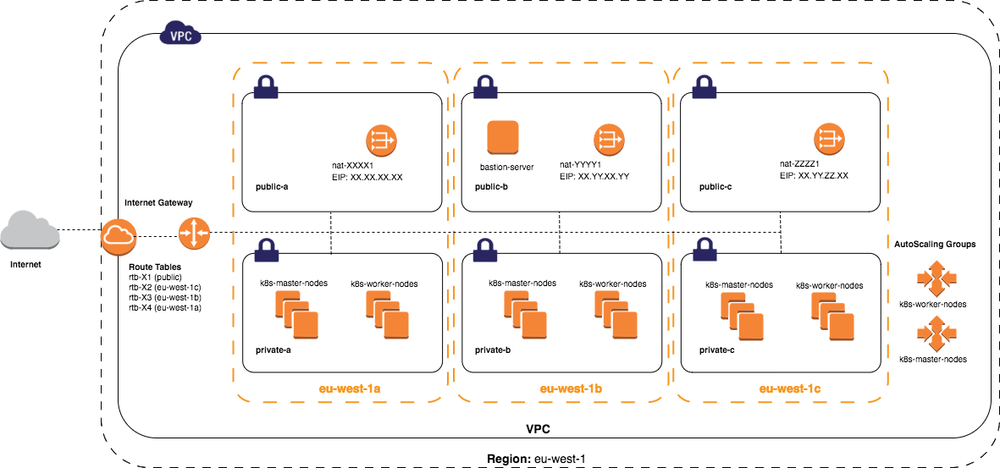

# Create infra

## Quick Start / In a nutshell

All modules are desinged to be self contained you could basically do somthing like:

```sh
pushd $dir
terraform init
terraform plan -out `basename $PWD`.plan && \
terraform apply `basename $PWD`.plan
```

Which is basically what `terraform`'s life-cycle brings to the table.
A more detailed expelnation is desined in steps 1,2 & 3 below:

## Step 1 - Base Module

**Module's Goals:** create state bucket and dynamoDB state table for terraform state management, history, lock (state locks), and audit.

**Module's Usage Frequency:** This module needs to run everytime you add a new IAM user to the "automation team", considering this module creates the state store for terraform to use later down the automation pipeline.

* In order to create a `state dynamoDB table` and `state bucket in s3` and allow certain iam users to access it we run the following:

```sh
export AWS_PROFILE=spacemesh
cd ./deployment/terraform/base
terraform init
terraform plan -out `basename $PWD`.plan && \
terraform apply `basename $PWD`.plan
```

At this point you should have an `s3 bucket` `DynamoDB` table and permissions granted to the iam users you specify in the operators variable as an exmaple:

```json
variable "operators" {
  default = [
     "automation",
      ]
}
```

*Please note:* for chicken egg reasons this "module's" state is stored in git ! (in order to create the s3 bucket for the state people usually do it manually ... :( which isn't elegant / reproducible and the state of the bucket is not managed ...)

## STEP 2 - MAIN VPC & EKS

**Module's Goals:** create the underlaying infrustructure for multipule kubernetes clusters in the same / differente regsions based on templating the best practices for `eks` to consume as variables.



**Module's Usage Frequency:** This module needs to run ->

1. Everytime you change a VPC settings
1. Add / remove gateways, routes, tags etc
1. Change / Add security groups,
1. Customize the IAM role of a certain group of nodes (so Kubernetes can do it's AWS related stuff ... like provision an ELB)

```sh
cd ../terraform/prd-eu
terraform init -backend.config=backend.tfvars
terraform plan -out `basename $PWD`.plan && \
terraform apply `basename $PWD`.plan
```

*See!* - using the `backend.tfvars` which has the s3bucket & etc state information.

A successful exacution of this module would result in an eks cluster in your newley created vpc.